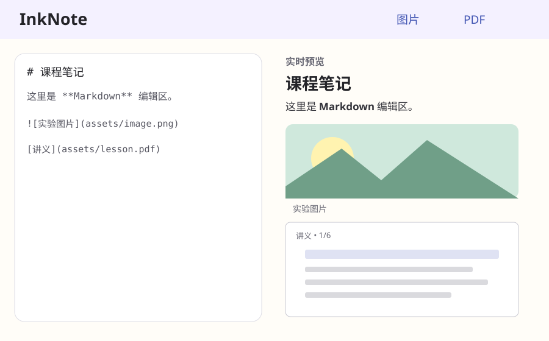

# InkNote Android

一个独立、离线优先的 Android Markdown 笔记应用。

## 下载 APK

**[直接下载 InkNote 0.4.2 APK](https://github.com/Mlevngr/note/releases/download/v0.4.2/InkNote-0.4.2.apk)**

也可以进入 [GitHub Releases](https://github.com/Mlevngr/note/releases) 选择最新版本。APK 使用固定测试签名，适合当前测试阶段直接安装和覆盖更新。

> 0.4.0 首次切换到固定签名，因此从 0.3.1 升级时需要最后卸载一次旧版。安装
> 0.4.0 后，后续 GitHub Release 可以直接覆盖更新。固定签名仅用于当前开源测试分发，
> 不是未来 Google Play 的生产密钥。

## 行级编辑与实时预览



InkNote 有清晰的阅读、编辑两种模式：

- 阅读模式没有光标，所有行都是渲染结果。
- 编辑模式只有光标所在行显示 Markdown 源码，其他行继续显示渲染结果。
- 点击另一行会直接移动编辑位置，不需要点击“完成”。
- 阅读模式下长按任意行会直接进入编辑模式并定位到该行。
- 在当前行按回车会拆分并进入下一行。
- 在行首按退格会合并到上一行，刚换行后可立即退回上一行。
- 右上角的书写/阅读图标切换模式，链接形状的图标统一负责插入文件。
- 图标、状态栏和编辑界面跟随系统明亮/深色主题。
- 编辑源码会按屏幕宽度自动折行；回车仍会创建下一条 Markdown 源码行。
- 提供 Adaptive Launcher 图标和 Android 13+ 单色主题图标。

当前测试签名证书 SHA-256：

```text
59:BD:95:A3:7B:99:16:C7:DC:07:3C:AF:54:47:4E:5F:ED:5E:A1:12:27:0D:A2:2F:7D:F1:4C:33:69:2E:D1:2D
```

## 文件插入

插入按钮使用 Android 系统文件选择器，并根据所选文件自动处理：

- 图片直接显示。
- PDF 展开为真实页面，页面在接近屏幕时才渲染。
- 其他文件显示为附件卡片。
- 所有文件都会复制到当前笔记的私有 `assets/` 目录；笔记不会依赖原文件 URI，也不会创建可点击的外部链接。

InkNote 使用非链接的本地嵌入指令：

```markdown
![[asset:assets/uuid.png|照片]]
![[asset:assets/uuid.pdf|课程讲义]]
![[asset:assets/uuid.zip|资料包]]
```

旧版本写入的标准 Markdown 图片与本地 PDF 链接仍可正常预览。

## 当前 MVP

- 行级混合 Markdown 编辑
- CommonMark、标题、强调、单行列表/引用、任务项和删除线渲染
- 图片、PDF 与普通附件的统一导入
- 文件复制到笔记私有目录，无存储权限、无网络依赖
- 原子自动保存

## 本地数据结构

```text
files/notes/welcome/
├── note.md
└── assets/
    ├── uuid.png
    ├── uuid.pdf
    └── uuid.zip
```

## 构建

```bash
./gradlew testDebugUnitTest lintDebug assembleDebug
```

当前里程碑使用一个本地笔记。多笔记管理、手写、PDF 标注和套索编辑属于后续里程碑。
